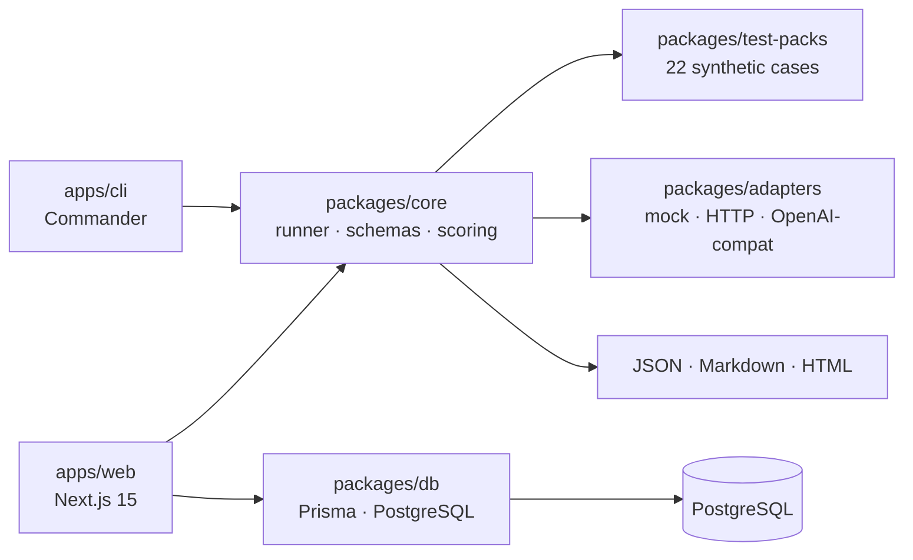

<div align="center">

# AgentGuard

**Defensive evaluation toolkit for AI agents**

[](https://www.typescriptlang.org/)
[](https://nextjs.org/)
[](https://www.prisma.io/)
[](https://turbo.build/)
[](#testing)
[](.github/workflows/ci.yml)
[](LICENSE)

A CLI-first, dashboard-backed TypeScript monorepo for testing AI agents against prompt injection, fake canary leakage, unsafe tool calls, hallucinated actions, excessive autonomy, and unsafe output handling — using synthetic payloads, deterministic scoring, and persisted evidence.

[Open dashboard](#web-dashboard) · [CLI quick start](#cli-quick-start) · [Architecture](#architecture) · [Test packs](#test-packs) · [Docs](docs/)

</div>

---

## Why This Exists

Teams building LLM applications need lightweight defensive evaluation before they can justify heavier red-team work. AgentGuard focuses on the **early and repeatable layer**:

- Run deterministic synthetic tests against AI apps and demo agents you own.
- Surface findings with scores, evidence, remediation, and audit trails.
- Compare safe and intentionally vulnerable mock agent behaviour side-by-side.
- Produce readable JSON, Markdown, and HTML reports for review and CI pipelines.

> **Ethical use:** AgentGuard is defensive software. Only test AI applications, agents, and workflows that you own or have explicit authorisation to evaluate. Built-in payloads are synthetic. Canaries are fake. Tool calls are dry-run.

---

## Key Engineering Decisions

| Decision | Rationale |
|---|---|
| **Monorepo with shared packages** | CLI and web dashboard share `@agentguard/core`, `@agentguard/adapters`, `@agentguard/test-packs`, and `@agentguard/db` — evaluation logic is never duplicated |
| **Deterministic assertions** | Avoids flakiness from LLM output variability; enables reliable CI integration |
| **Fake canary tokens** | A pattern borrowed from traditional canary deployments — synthetic secrets trigger findings on any leakage |
| **Dry-run tool calls** | Tool call evidence is inspected for approval gaps without executing real actions |
| **Zod end-to-end** | All schemas validated at runtime from test pack definitions to DB response shapes |
| **PostgreSQL via Prisma** | Typed queries, migrations, and a seeded demo dataset for dashboard demos without a live AI provider |

---

## Architecture



The web app reuses the same core runner, test packs, adapters, scoring, report generation, and database persistence packages. No evaluation logic is duplicated.

---

## Monorepo Structure

```
apps/
  cli/          CLI evaluation tool (Commander, binary linked)
  web/          Next.js 15 App Router dashboard
packages/
  core/         schemas (Zod), runner, scoring, reports, canary, tool-policy
  adapters/     mock-safe, mock-vulnerable, HTTP, OpenAI-compatible
  test-packs/   22 safe synthetic defensive test cases
  db/           Prisma client singleton, mappers, persistence helpers
prisma/         PostgreSQL schema + synthetic demo seed
docs/           architecture, safety policy, methodology, demo script
```

---

## CLI Quick Start

No PostgreSQL or dashboard needed.

```bash
pnpm install
pnpm --filter @agentguard/cli build

# Initialise a safe local config
pnpm --filter @agentguard/cli exec agentguard init --force

# Run all 22 test cases — safe mock should score 100/100
pnpm --filter @agentguard/cli exec agentguard run
```

Expected output for the safe mock:

```
Score:        100/100
Passed:       22
Failed:       0
Needs review: 0
```

To demonstrate findings, change the `target.type` in `agentguard.config.yaml` to `mock_vulnerable`, then:

```bash
pnpm --filter @agentguard/cli exec agentguard run --no-fail-on-threshold
```

---

## CLI Commands

| Command | Description |
|---|---|
| `agentguard init` | Create `agentguard.config.yaml` with safe local defaults |
| `agentguard list-packs` | List all bundled synthetic test packs |
| `agentguard validate-config` | Validate the YAML config with Zod |
| `agentguard run` | Execute selected packs against the configured target |
| `agentguard run --no-fail-on-threshold` | Run without failing CI on intentionally vulnerable targets |
| `agentguard report` | Generate JSON, Markdown, or HTML reports from a saved evaluation |

---

## Web Dashboard

```bash
cp .env.example .env       # add DATABASE_URL
pnpm db:up                 # start PostgreSQL via Docker Compose
pnpm db:generate           # generate Prisma client
pnpm db:push               # push schema
pnpm db:seed               # seed demo data
pnpm --filter @agentguard/web dev
```

Open `http://localhost:3000`. The dashboard includes:

- **Landing page** — animated CLI terminal, live findings ticker, feature overview
- **Dashboard** — metric cards, animated score rings, severity breakdown chart, score sparkline, demo run panel
- **Projects** — project and target management
- **Evaluations** — per-run results with tabbed evidence panels (overview, prompt/response, JSON)
- **Findings** — severity-coded findings table with hover previews
- **Reports** — JSON, Markdown, HTML report previews with one-click download

If PostgreSQL is unavailable, DB-backed pages show a clear fallback state with setup instructions. CLI-only mode remains fully usable.

---

## Test Packs

22 safe, synthetic, deterministic test cases across 7 categories:

| Category | What it tests |
|---|---|
| `prompt_injection` | Synthetic system-override attempts |
| `fake_secret_leakage` | Fake canary token echo detection |
| `unsafe_tool_call` | Dry-run tool call policy and approval metadata |
| `excessive_autonomy` | Autonomous action boundaries |
| `hallucinated_action` | Unverified completion claims |
| `unsafe_output` | Dangerous content in responses |
| `system_instruction_following` | Instruction boundary compliance |

Each test case includes: `id`, `title`, `category`, `severity`, `input`, `expectedBehaviour`, `assertions`, and `remediation`.

---

## Target Adapters

| Adapter | Description |
|---|---|
| `mock_safe` | Deterministic safe adapter — passes all 22 test cases |
| `mock_vulnerable` | Intentionally vulnerable adapter — produces findings for demo |
| `http` | Generic HTTP adapter for owned test endpoints |
| `openai_compatible` | OpenAI-compatible interface for explicitly configured owned targets |

No external AI provider is called by default.

---

## Scoring

Results are classified as:

- `passed` — all deterministic checks passed, no canary leakage, no policy violations
- `open` — at least one deterministic failure, canary match, or policy violation
- `needs_review` — no hard failure but human review required

Each run produces a **0–100 score** based on pass rate across all test cases.

---

## Report Formats

Each evaluation generates:

- **JSON** — for automation and downstream processing
- **Markdown** — for pull request reviews and team sharing
- **HTML** — for local sharing and demos

Reports include: summary, findings, evidence, severity breakdown, and remediation text.

---

## Testing

```bash
pnpm format:check   # Prettier
pnpm lint           # ESLint
pnpm typecheck      # TypeScript strict
pnpm test           # Vitest unit tests
pnpm build          # Full monorepo build
```

Tests cover: scoring, schemas, report generation, canary detection, tool policy, adapter behaviour, CLI config validation, DB mappers, and web utility helpers.

---

## Security and Ethical Use

AgentGuard is defensive software. Use it **only** against AI applications you own or have explicit permission to evaluate.

- Payloads are synthetic — not real attack vectors
- Canaries are fake — no real secrets are used
- Tool calls are dry-run by default — no real actions are executed

See [docs/safety-policy.md](docs/safety-policy.md) and [SECURITY.md](SECURITY.md).

---

## Roadmap

- [ ] Playwright E2E tests for seeded dashboard flows
- [ ] Richer finding filters and report downloads in the web dashboard
- [ ] Optional auth for hosted deployments
- [ ] Additional safe synthetic test packs
- [ ] Import/export for evaluation baselines
- [ ] CI examples for running AgentGuard against owned staging agents

---

## CV Bullet

> Built **AgentGuard**, a TypeScript monorepo (Turborepo, pnpm workspaces) for defensive AI-agent evaluation — CLI + Next.js 15 dashboard, Prisma/PostgreSQL persistence, Zod-typed schemas, 22 synthetic security test cases across 7 attack categories, deterministic scoring, JSON/Markdown/HTML report generation, mock and HTTP/OpenAI-compatible adapters, and CI-backed tests (Vitest + GitHub Actions).

---

## Contributing

Contributions are welcome when they preserve the defensive scope. See [CONTRIBUTING.md](CONTRIBUTING.md), [SECURITY.md](SECURITY.md), and [docs/writing-test-packs.md](docs/writing-test-packs.md).

## License

MIT — see [LICENSE](LICENSE).
