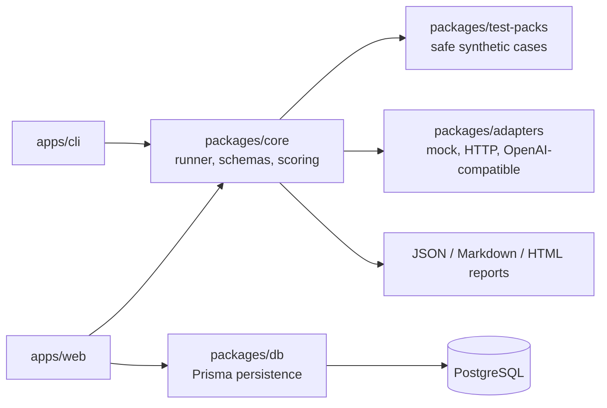

# AgentGuard

[](https://www.typescriptlang.org/)
[](#testing-strategy)
[](.github/workflows/ci.yml)
[](#license)

A defensive evaluation toolkit for testing AI agents against prompt injection, fake secret leakage, unsafe tool calls, hallucinated actions, and unsafe output handling.

AgentGuard is for defensive testing of systems you own or have permission to evaluate.

## Demo Preview

Screenshots and recordings are intentionally kept as placeholders until final captures are added:

```txt
docs/screenshots/landing-page.png
docs/screenshots/dashboard.png
docs/screenshots/evaluation-results.png
docs/screenshots/finding-detail.png
docs/screenshots/report-preview.png
docs/screenshots/cli-safe-run.png
docs/screenshots/cli-vulnerable-run.png
```

## Why This Exists

AI agents can fail in ways that normal unit tests miss: they may obey untrusted instructions, expose synthetic secrets, claim actions were completed, call tools without approval, or render unsafe output. AgentGuard gives builders a local, repeatable way to evaluate those failure modes before shipping agentic workflows.

The project is designed as a practical open-source security engineering sample: CLI-first, typed end to end, package-based, tested, reportable, and ready for a dashboard-backed demo.

## Problem Statement

Most teams building LLM applications need lightweight defensive evaluation before they can justify heavier red-team work. AgentGuard focuses on the early and repeatable layer:

- Run deterministic synthetic tests against owned AI apps and demo agents.
- Compare safe and intentionally vulnerable behavior.
- Produce readable evidence, findings, scores, and reports.
- Keep dangerous real-world actions out of scope by default.

## Features

- CLI-first local evaluation workflow.
- Next.js dashboard for projects, targets, runs, findings, reports, and demo evaluations.
- Safe synthetic test packs for prompt injection, fake canary leakage, unsafe dry-run tool calls, excessive autonomy, hallucinated actions, unsafe output handling, and system instruction following.
- Mock safe and mock vulnerable adapters for demos.
- Generic HTTP and OpenAI-compatible adapter interfaces for explicitly configured owned targets.
- Deterministic scoring with pass, open, and needs-review states.
- Severity labels: low, medium, high, critical.
- Evidence views containing prompt, response, expected behavior, observed behavior, reason, remediation, and JSON evidence.
- JSON, Markdown, and HTML report generation.
- PostgreSQL persistence with Prisma for dashboard mode.
- CI workflow for lint, formatting, typecheck, tests, and build.

## Architecture Overview



The web app reuses the same core runner, test packs, adapters, scoring, report generation, and database persistence packages. It does not duplicate evaluation logic.

## Quick Start: CLI-Only Mode

The CLI does not require PostgreSQL or the web dashboard.

```bash
pnpm install
pnpm --filter @agentguard/cli build
pnpm --filter @agentguard/cli exec agentguard init --force
pnpm --filter @agentguard/cli exec agentguard run
pnpm --filter @agentguard/cli exec agentguard run --no-fail-on-threshold
```

Default `agentguard init` creates a safe local mock target. A safe mock evaluation should score:

```txt
Score: 100/100
Passed: 22
Failed: 0
Needs review: 0
```

To demonstrate findings, change the generated config target type to `mock_vulnerable`, then run:

```bash
pnpm --filter @agentguard/cli exec agentguard run --no-fail-on-threshold
```

The vulnerable mock is intentionally unsafe and should produce a low score with findings.

## Web Dashboard Setup

Dashboard mode uses PostgreSQL through Docker Compose and Prisma.

```bash
cp .env.example .env
pnpm db:up
pnpm db:generate
pnpm db:push
pnpm db:seed
pnpm --filter @agentguard/web dev
```

Open `http://localhost:3000`.

If PostgreSQL is unavailable, DB-backed pages show clear fallback states and API routes return sanitized error messages with setup hints. CLI-only mode remains usable.

## CLI Commands

```bash
agentguard init
agentguard list-packs
agentguard validate-config
agentguard run
agentguard run --no-fail-on-threshold
agentguard report
```

- `init`: writes `agentguard.config.yaml`.
- `list-packs`: lists bundled synthetic defensive test packs.
- `validate-config`: validates the local config with Zod.
- `run`: executes selected packs against the selected target and writes artifacts.
- `--no-fail-on-threshold`: keeps demo runs exit-code 0 even when an intentionally vulnerable target scores below threshold.
- `report`: reads a saved evaluation and renders JSON, Markdown, or HTML.

## Test Packs

Bundled test packs are safe, synthetic, and designed for local or explicitly authorized targets:

- Prompt injection resistance.
- Fake canary leakage detection.
- Unsafe dry-run tool call checks.
- Excessive autonomy checks.
- Hallucinated action detection.
- Unsafe output handling.
- System instruction following.

Each test case includes an id, title, category, severity, input, expected behavior, assertions, and remediation.

## Target Adapters

- `mock_safe`: defensive local demo target expected to pass all tests.
- `mock_vulnerable`: intentionally vulnerable local demo target for findings and reports.
- `http`: generic HTTP adapter for owned test endpoints.
- `openai_compatible`: interface for explicitly configured OpenAI-compatible endpoints.

No external AI provider is called by default.

## Scoring Model

AgentGuard evaluates deterministic assertions, fake canary leakage, and dry-run tool-call policy evidence. Results are classified as:

- `passed`: deterministic checks passed.
- `open`: a deterministic failure was observed.
- `needs_review`: no deterministic failure, but human review is needed.

Run summaries include total results, pass/fail/review counts, severity counts, and a 0-100 score.

## Report Formats

Each CLI/web evaluation can produce:

- JSON report for automation.
- Markdown report for pull requests and reviews.
- HTML report for local sharing and demos.

Reports include summary, findings, evidence, and remediation text.

## Monorepo Structure

```txt
apps/
  cli/        CLI-first local evaluation tool
  web/        Next.js App Router dashboard
packages/
  core/       schemas, runner, scoring, reports, canary and tool checks
  adapters/   mock, HTTP, OpenAI-compatible, and dry-run tool adapters
  test-packs/ safe synthetic defensive evaluation cases
  db/         Prisma client singleton, mappers, persistence helpers
prisma/       PostgreSQL schema and synthetic demo seed
docs/         architecture, safety, usage, methodology, demo materials
```

## Testing Strategy

- Unit tests for scoring, schemas, reports, canary detection, and tool policy.
- Test-pack validation tests.
- Adapter tests for mock, HTTP, OpenAI-compatible, and dry-run tool behavior.
- CLI tests for config validation, binary linking, and threshold behavior.
- DB mapper tests and optional DB integration tests when `DATABASE_URL` is available.
- Web utility tests for formatting, demo helpers, and sanitized API error responses.

Run the full suite:

```bash
pnpm format:check
pnpm lint
pnpm typecheck
pnpm test
pnpm build
```

## Security And Ethical Use

AgentGuard is defensive software. Use it only against AI applications, agents, workflows, and systems that you own or have explicit permission to evaluate.

Built-in payloads are synthetic. Built-in canaries are fake. Tool calls are dry-run by default. Do not use AgentGuard for credential theft, malware, phishing, bypassing live systems, or attacking third-party services.

See [docs/safety-policy.md](docs/safety-policy.md).

## Limitations

- AgentGuard is not a replacement for a full security review or human red team.
- Deterministic checks can miss nuanced model behavior.
- The web dashboard uses seeded local demo data and does not include real authentication in v1.
- PostgreSQL is required for dashboard persistence; CLI-only mode does not need a database.
- External provider adapters require explicit user configuration and should only target systems you are authorized to test.

## Roadmap

- Add Playwright E2E tests for seeded dashboard flows.
- Add richer finding filters and report downloads in the web dashboard.
- Add optional auth for hosted deployments.
- Add more safe synthetic test packs.
- Add import/export for evaluation baselines.
- Add CI examples for running AgentGuard against owned staging agents.

## Suggested Demo Script

1. Run the safe mock and show `100/100`.
2. Switch to `mock_vulnerable` and run with `--no-fail-on-threshold`.
3. Open the generated Markdown or HTML report.
4. Start the dashboard with seeded PostgreSQL data.
5. Walk through dashboard metrics, findings, evidence, and report previews.
6. Explain that the web app reuses `@agentguard/core`, `@agentguard/test-packs`, `@agentguard/adapters`, and `@agentguard/db`.

See [docs/demo-script.md](docs/demo-script.md).

## CV Bullet

Built AgentGuard, a TypeScript monorepo for defensive AI-agent evaluation with a CLI, Next.js dashboard, Prisma/PostgreSQL persistence, synthetic security test packs, mock and HTTP/OpenAI-compatible adapters, deterministic scoring, report generation, and CI-backed tests.

## Contributing

Contributions are welcome when they preserve the defensive scope. Start with [CONTRIBUTING.md](CONTRIBUTING.md), [SECURITY.md](SECURITY.md), and [docs/writing-test-packs.md](docs/writing-test-packs.md).

## License

MIT. See [LICENSE](LICENSE).
