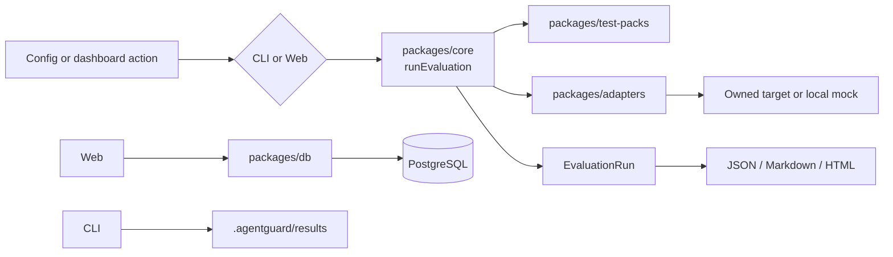

# Architecture

AgentGuard is a TypeScript monorepo built around a package-independent core. The CLI and web dashboard are clients of the same evaluation engine, test packs, adapters, reports, and persistence helpers.

## Packages

```txt
apps/cli
  Local command-line workflow. Reads agentguard.config.yaml, validates config, runs evaluations, and writes reports.

apps/web
  Next.js App Router dashboard. Reads persisted projects, targets, runs, findings, and reports from PostgreSQL through @agentguard/db.

packages/core
  Schemas, runner, scoring, canary detection, tool-call policy validation, taxonomy, remediation, and report generators.

packages/test-packs
  Safe synthetic defensive test cases grouped by failure mode.

packages/adapters
  Target adapters for mock safe, mock vulnerable, generic HTTP, OpenAI-compatible interfaces, and dry-run tool-call helpers.

packages/db
  Prisma client singleton, mapping helpers, and persistence services for evaluation runs.

prisma
  PostgreSQL schema and deterministic synthetic seed data.
```

## Data Flow



## Why Core Is Package-Independent

`packages/core` does not depend on Next.js, Commander, Prisma, Docker, or any provider SDK. It accepts test packs and an `invokeTarget` function, then returns a validated `EvaluationRun`.

This keeps evaluation behavior consistent across:

- CLI-only local runs.
- Dashboard demo runs.
- Unit and integration tests.
- Future CI or hosted evaluation workflows.

## Boundaries

- Scoring belongs in `@agentguard/core`.
- Test definitions belong in `@agentguard/test-packs`.
- Target behavior belongs in `@agentguard/adapters`.
- Database persistence belongs in `@agentguard/db`.
- The CLI and web app orchestrate these packages but do not rewrite their logic.

## Runtime Modes

CLI-only mode requires Node.js and pnpm. It does not require PostgreSQL.

Dashboard mode requires PostgreSQL, Prisma client generation, and seeded local demo data.
